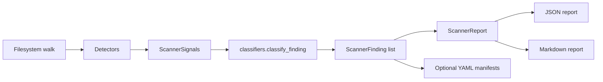

# Architecture

ReckLock Discover is a **single-process**, **offline** static analyzer. It walks the filesystem under a repository root, reads text files matching configurable extensions, runs deterministic detectors (mostly regex-based), classifies combined signals into findings, optionally exports YAML manifests, and writes JSON & Markdown reports.

## Module map

| Module | Role |
| --- | --- |
| `scanner.py` | Directory walk, include/exclude globs, file caps, orchestrates detectors → classifiers → `ScannerReport`. |
| `detectors.py` | Signal detectors: LLM, outbound, browser/HTTP, deploy/infra, database, payments, secrets, schedule, shell, CI/CD; filename & dependency-manifest hooks. |
| `classifiers.py` | Maps signal sets to finding type, confidence, risk level, capabilities/scopes, recommended action, rationale. |
| `models.py` | Pydantic models for signals, findings, and aggregate reports. |
| `report.py` | JSON/Markdown serialization with structured sections for humans & CI. |
| `manifest_export.py` | Builds registry-compatible YAML drafts from high-value findings. |
| `manifest_schema.py` | Minimal `AgentManifest` validation mirror for exported YAML. |
| `redaction.py` | Snippet redaction so reports do not echo raw secrets. |
| `constants.py` | Version caps (`MAX_FILES`, `MAX_FILE_BYTES`), filenames. |
| `utils.py` | CSV glob parsing, exclude normalization, fnmatch helpers. |
| `cli.py` | Typer + Rich entrypoint (`recklock-discover scan …`). |

## Data flow

## Determinism

Given the same repository bytes & CLI flags, runs are deterministic aside from:

- `scanned_at` timestamp in reports  
- Ordering is stable (sorted paths & finding ids).

There is **no network I/O**, **no randomness**, and **no persistent cache** between runs.
